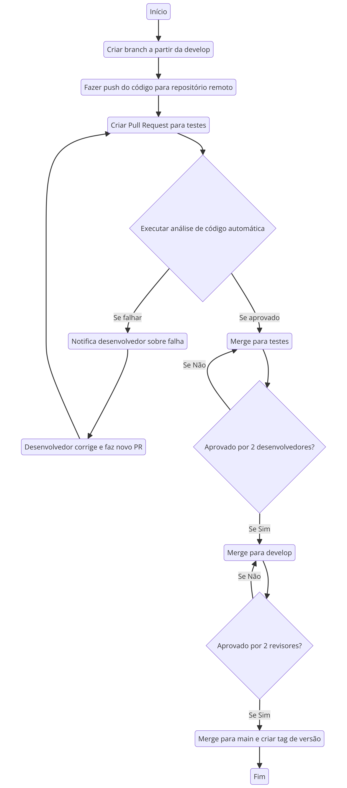

# Fluxo de Trabalho Git

---




## Fluxo Geral de Trabalho com Branches

### Branches Principais
1. **main**: Contém o código estável e pronto para produção.
2. **develop**: É onde ocorre o desenvolvimento ativo, validado antes de ser integrado na `main`.

### Branches Secundárias
3. **testes**: Validações automáticas (testes automatizados) são feitos aqui.
4. **feature/<nome-da-funcionalidade>**: Criadas para desenvolver novas funcionalidades.

---

## Passos do Fluxo de Trabalho

1. **Criação de Branch Temporária**  
O desenvolvedor cria uma nova branch a partir de `develop`:
   ```bash
   git checkout develop
   git pull origin develop
   git checkout -b feature/<nome-da-funcionalidade>
   ```

2. **Desenvolvimento e Push**  
Após implementar a funcionalidade, o desenvolvedor faz commit e push para o repositório remoto:
   ```bash
   git add .
   git commit -m "Implementar <nome-da-funcionalidade>"
   git push origin feature/<nome-da-funcionalidade>
   ```

3. **Pull Request para `testes`**  
O desenvolvedor abre um Pull Request (PR) da branch `feature/<nome-da-funcionalidade>` para a branch `testes`.  

4. **Revisão do PR**  
   - **Se a análise falhar**: O desenvolvedor é notificado e deve corrigir os problemas na branch `feature/<nome-da-funcionalidade>`:  
     ```bash
     git checkout feature/<nome-da-funcionalidade>
     # Correções necessárias
     git add .
     git commit -m "Corrigir problemas reportados"
     git push origin feature/<nome-da-funcionalidade>
     ```
     Se aprovado: O PR é integrado na branch testes.

5. **Integração na Branch `develop`**  
Após aprovação por dois desenvolvedores na branch `testes`, o código é integrado na branch `develop`:  
   ```bash
   git checkout develop
   git merge testes
   git push origin develop
   ```

6. **Integração na Branch `main` e Criação de Tag**  
Quando o código em `develop` está pronto para produção e aprovado por dois revisores: 
   - Faz-se merge para `main`:  
     ```bash
     git checkout main
     git merge develop
     git push origin main
     ```  
   - Uma tag de versão é criada automaticamente.

---

## Resumo do Processo

1. **Branch de funcionalidade (`feature/`)**:  
   - Criada a partir de `develop`.  
   - Submetida para validação na branch `testes`.  

2. **Branch `testes`**:  
   - Validações automáticas .

3. **Branch `develop`**:  
   - Integra funcionalidades validadas.  
   - Serve como base para a branch `main`.  

4. **Branch `main`**:  
   - Contém código pronto para produção.  
   - Tags de versão identificam cada release.

```plaintext
.github/workflows  
.githooks           
docs/               # Documentação técnica.
images/             # Imagens para documentação.
README.md           # Informações gerais do projeto
````


